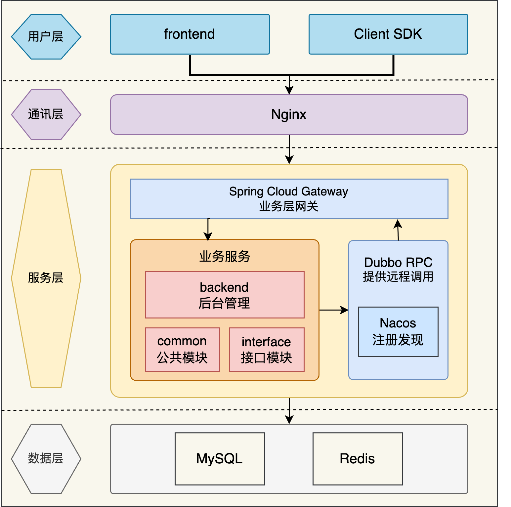
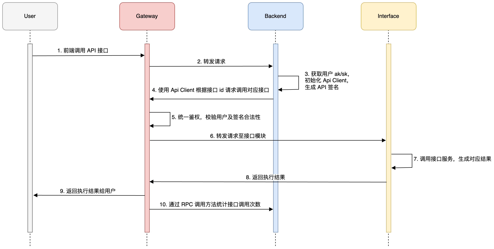

# API Hub
### 项目介绍
API Hub 是基于 Spring Boot + Spring Cloud Gateway + Dubbo + Nacos 开发的 API 接口开放平台。用户可浏览并在线调用接口；管理员可在后台发布或下线接口，并可视化各接口的调用情况；同时提供了客户端 SDK 便于开发者接入并调用第三方接口。

### 项目架构

### **业务流程**

### 主要工作
1. 根据业务流程，将项目后端划分为后台管理系统、客户端 SDK、API 网关、模拟接口和公共模块共 5 个子项目；
2. 为防止接口被恶意调用，实现了 API 签名认证，为用户分配唯一的 AccessKey 和 SecretKey 以鉴权，并在请求头中添加随机数和时间戳以防止重放攻击，保障调用接口的安全性；
3. 选用 Spring Cloud Gateway 作为 API 网关，实现了路由转发、流量染色、统一鉴权以及接口调用统计等业务逻辑；
4. 基于 Spring Boot Starter 自主设计开发了客户端 SDK，实现一行代码即可调用接口，改善开发体验；
5. 为减少冗余代码，将模型层和业务层抽象为公共模块，并使用 Dubbo RPC 框架进行服务间调用，解决了跨服务代码调用问题。